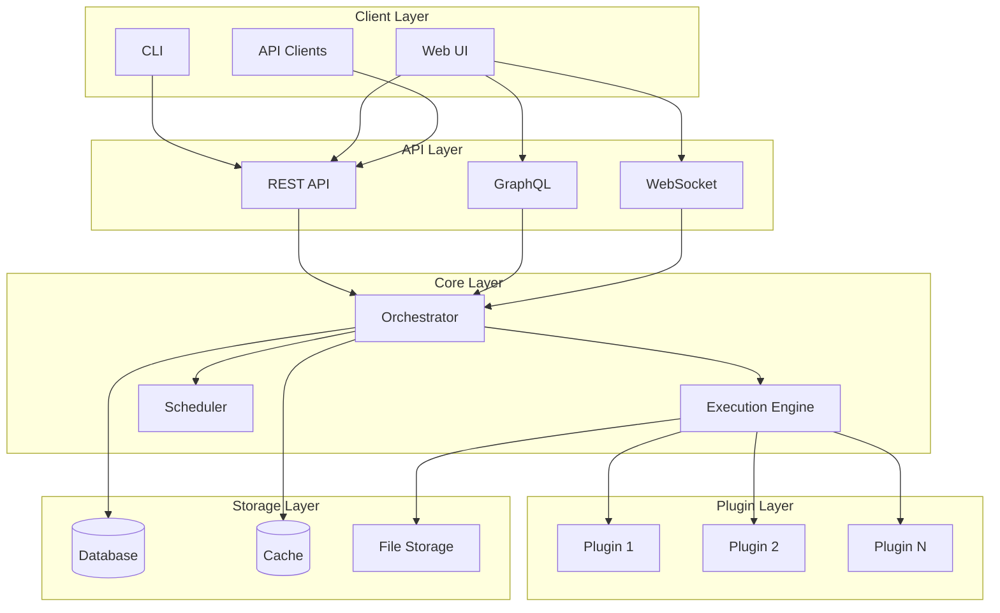

# Mrki

<p align="center">
  
</p>

<p align="center">
  <strong>A powerful workflow automation platform for modern teams</strong>
</p>

<p align="center">
  <a href="https://github.com/mrki/mrki/actions/workflows/ci.yml">
    
  </a>
  <a href="https://codecov.io/gh/mrki/mrki">
    
  </a>
  <a href="https://pypi.org/project/mrki/">
    
  </a>
  <a href="https://pypi.org/project/mrki/">
    
  </a>
  <a href="https://mrki.readthedocs.io">
    
  </a>
  <a href="LICENSE">
    
  </a>
</p>

---

## 🚀 Features

- **🔧 Workflow Engine** - Create and execute complex workflows with dependencies
- **📅 Task Scheduler** - Schedule tasks with cron expressions
- **🔌 Plugin System** - Extend functionality with custom plugins
- **🌐 REST API** - Full programmatic access via RESTful API
- **💻 CLI Tools** - Powerful command-line interface
- **🖥️ Web Dashboard** - Intuitive web interface for management
- **📊 Monitoring** - Built-in metrics and logging
- **🔒 Security** - API key and JWT authentication

## 📋 Table of Contents

- [Installation](#installation)
- [Quick Start](#quick-start)
- [Architecture](#architecture)
- [Documentation](#documentation)
- [Contributing](#contributing)
- [License](#license)

## 📦 Installation

### From PyPI (Recommended)

```bash
pip install mrki
```

### From Source

```bash
git clone https://github.com/mrki/mrki.git
cd mrki
pip install -e ".[dev]"
```

### Using Docker

```bash
docker pull mrki/mrki:latest
docker run -p 8080:8080 mrki/mrki:latest
```

## 🚀 Quick Start

### 1. Start the Server

```bash
mrki server start
```

### 2. Create Your First Workflow

```python
import mrki

# Create a client
client = mrki.Client()

# Create a workflow
workflow = client.workflows.create(
    name="hello-world",
    steps=[
        {
            "name": "greet",
            "action": "echo",
            "params": {"message": "Hello, World!"}
        }
    ]
)

# Execute the workflow
result = workflow.execute()
print(result)
```

### 3. Using the CLI

```bash
# Create a workflow
mrki workflow create --name hello-world --file workflow.yaml

# Execute it
mrki workflow run hello-world

# View logs
mrki workflow logs hello-world
```

### 4. Using the Web Interface

Open your browser and navigate to `http://localhost:8080`

## 🏗️ Architecture



## 📊 Workflow Example

```yaml
name: data-processing-pipeline
description: Process daily data from multiple sources

variables:
  api_url: "https://api.example.com"
  database_url: "postgresql://localhost/analytics"

steps:
  - name: fetch-customers
    action: http.get
    params:
      url: "{{ variables.api_url }}/customers"
    
  - name: fetch-orders
    action: http.get
    params:
      url: "{{ variables.api_url }}/orders"
    
  - name: process-data
    action: transform.join
    params:
      left: "{{ steps.fetch-customers.output }}"
      right: "{{ steps.fetch-orders.output }}"
      key: "customer_id"
    depends_on:
      - fetch-customers
      - fetch-orders
  
  - name: save-to-database
    action: database.insert
    params:
      connection: "{{ variables.database_url }}"
      table: "daily_reports"
      data: "{{ steps.process-data.output }}"
    depends_on:
      - process-data
  
  - name: send-notification
    action: email.send
    params:
      to: "admin@example.com"
      subject: "Daily Report Complete"
      body: "Report generated successfully"
    depends_on:
      - save-to-database
```

## 📚 Documentation

Full documentation is available at [mrki.readthedocs.io](https://mrki.readthedocs.io)

- [Installation Guide](https://mrki.readthedocs.io/guides/installation/)
- [User Guide](https://mrki.readthedocs.io/guides/usage/)
- [API Reference](https://mrki.readthedocs.io/api/)
- [Configuration](https://mrki.readthedocs.io/guides/configuration/)

## 🤝 Contributing

We welcome contributions! Please see our [Contributing Guide](CONTRIBUTING.md) for details.

### Development Setup

```bash
# Clone the repository
git clone https://github.com/mrki/mrki.git
cd mrki

# Create virtual environment
python -m venv venv
source venv/bin/activate

# Install dependencies
pip install -e ".[dev,test,docs]"

# Run tests
pytest

# Run linting
make lint
```

## 🛣️ Roadmap

See our [Roadmap](https://mrki.readthedocs.io/guides/roadmap/) for upcoming features.

## 💬 Community

- 💬 [Discussions](https://github.com/mrki/mrki/discussions)
- 🐛 [Issue Tracker](https://github.com/mrki/mrki/issues)
- 📧 [Email](mailto:support@mrki.dev)

## 📄 License

This project is licensed under the Personal Use License - see the [LICENSE](LICENSE) file for details.

## 🙏 Acknowledgments

- Thanks to all [contributors](https://github.com/mrki/mrki/graphs/contributors)
- Inspired by [Apache Airflow](https://airflow.apache.org/) and [Prefect](https://www.prefect.io/)
- Built with [FastAPI](https://fastapi.tiangolo.com/) and [SQLAlchemy](https://www.sqlalchemy.org/)

---

<p align="center">
  Built with ❤️ by the Mrki team and contributors
</p>
