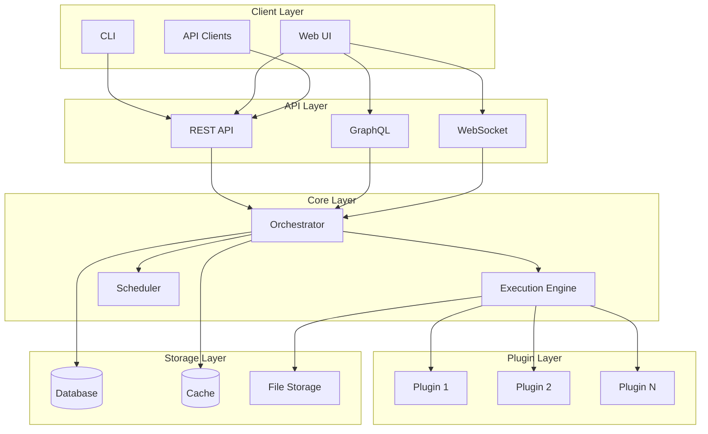

# Mrki Documentation

Welcome to the Mrki documentation! Mrki is a powerful multi-component system for intelligent automation and orchestration.

## Quick Links

- [Installation Guide](guides/installation.md) - Get started with Mrki
- [User Guide](guides/usage.md) - Learn how to use Mrki
- [API Reference](api/index.md) - Explore the API documentation
- [Configuration](guides/configuration.md) - Configure Mrki for your needs
- [Contributing](../CONTRIBUTING.md) - Contribute to Mrki

## What is Mrki?

Mrki is a comprehensive automation platform designed to simplify complex workflows through intelligent orchestration. It provides:

- **Modular Architecture**: Easily extendable component system
- **Powerful API**: RESTful API for integration
- **CLI Interface**: Command-line tools for power users
- **Web Dashboard**: Intuitive web interface for management
- **Plugin System**: Extend functionality with custom plugins

## Architecture Overview



## Getting Started

### Installation

```bash
# Install from PyPI
pip install mrki

# Or install with all optional dependencies
pip install mrki[all]
```

### Quick Start

```python
import mrki

# Initialize the client
client = mrki.Client()

# Create a workflow
workflow = client.create_workflow(
    name="my-workflow",
    steps=[
        {"action": "task1"},
        {"action": "task2"}
    ]
)

# Execute the workflow
result = workflow.execute()
print(result)
```

## Features

### Core Features

| Feature | Description | Status |
|---------|-------------|--------|
| Workflow Engine | Execute complex workflows | ✅ |
| Task Scheduler | Schedule and manage tasks | ✅ |
| Plugin System | Extend with custom plugins | ✅ |
| REST API | Full API access | ✅ |
| Web Dashboard | Management interface | ✅ |
| CLI Tools | Command-line interface | ✅ |

### Supported Integrations

- **Databases**: PostgreSQL, MySQL, MongoDB, Redis
- **Message Queues**: RabbitMQ, Kafka, Redis
- **Cloud Providers**: AWS, GCP, Azure
- **Version Control**: Git, GitHub, GitLab

## Project Status

Mrki is actively developed and maintained. See our [roadmap](guides/roadmap.md) for upcoming features.

## Support

- 📖 [Documentation](https://mrki.readthedocs.io)
- 💬 [Discussions](https://github.com/mrki/mrki/discussions)
- 🐛 [Issue Tracker](https://github.com/mrki/mrki/issues)
- 📧 [Email Support](mailto:support@mrki.dev)

## License

Mrki is licensed under the [Personal Use License](../LICENSE). See the LICENSE file for details.

---

*Built with ❤️ by the Mrki team and contributors.*
